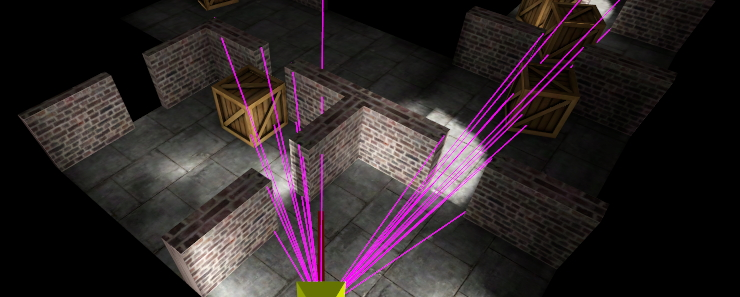

# godot-lportal 0.2
Portal rendering / Occlusion culling module for Godot 3.2

You can either use LPortal as a full occlusion culling system if you can create your level as rooms and portals, or use it in a simplified single room mode to speed up culling in any 3d level.

Note that this is a _Work in progress_. Feel free to try out the latest version (master) but recognise that the API may change as I move towards first release.

Video of initial testing:\
https://www.youtube.com/watch?v=uVwLltiouBs \
https://www.youtube.com/watch?v=xF_3Fe2HRdk \
https://www.youtube.com/watch?v=NmlWkkhGoJA

### Features
* Support for dynamic objects (DOBs)
* Dynamic lights
* Optional auto-generation of room bound convex hulls
* Internal lightmapping workflow (for baking lights in Godot)
* External lightmapping workflow (for baking lights in Blender etc)
* Single room mode (for non-portalled levels)

### Demos / Tutorials
https://github.com/lawnjelly/lportal-demos

_Feel free to leave suggestions / feature requests on the issue tracker, especially regarding ease of use._

## Current status
April 2nd 2020 - New API for DOBS. I had identified a breaking bug in the DOB visibility caused by the assumptions from the data coming from godot. It turns out when DOBs are hidden I can't retrieve their position etc from the Godot node, so I'm having to change the API for DOBs and dynamic lights so you pass the position manually each update. I've tested and this works.

Note that the new dob culling isn't totally finished yet, it simply culls based on which room the dob is within, and whether that room is visible. This is approximate and won't deal with the case where a dob should be casting a shadow into the frustum from a room that is not visible. I'll get more accurate dob culling and light tracing working again in time, but it should be okay for most cases to start with.

I am currently working on a small demo / test first person shooter game. This is helping me find bugs / add usability features as I go.

I've also written a small lightmapper which started out as a bit of fun, but will be integrated in LPortal. The current voxel based lightmapper in core 3.x has a lot of bugs. JFons has been writing a replacement lightmapper for core, and I may switch to that when it is available, or have both options available. My lightmapper (and I believe JFons also) are based on path tracing rather than voxels. Reduz has also written a new lightmapper for 4.x, but whether that will be backported to 3.x and will work on CPUs remains to be seen.

I'm going to be working on improving the user interface for LPortal, exposing some of the features in the LRoomManager node, and having editor plugins for both the lightmapper and lportal.

Note I'm also working on core renderers (batching in GLES2 and GLES3, and the new 4.x GLES renderers), so there may be some periods of inactivity on LPortal.

## Instructions
* [OVERVIEW](OCCLUSION_CULLING.md)
* [INSTRUCTIONS](INSTRUCTIONS.md)
* [INSTRUCTIONS for single room mode](INSTRUCTIONS_SINGLEROOM.md)
* [TUTORIAL](https://github.com/lawnjelly/lportal-demos/tree/master/Tutorial-Simple)

## Roadmap
* Auto conversion of named room spatials and portal mesh instances to LRoom and LPortal DONE
* Auto creation of mirror portals DONE
* Recursive determine visibility DONE
* Prevent memory allocations (use pools for plane vectors) DONE
* Add support for objects moving between rooms - cameras, players, physics etc - DONE
* Handle special cases (multiple portals views into room etc) DONE
* Optimize non-moving statics DONE
* Optional convex hull bound for rooms DONE
* Auto convex hull bound generation DONE
* Add debug graphical view of portal planes DONE
* Add debug graphical view of room bounds DONE
* Dealing with shadows from objects outside of view DONE
* Universal visibility query for camera and dynamic lights DONE
* Support for global directional lights (like the sun) DONE
* Internal baked lightmap workflow DONE
* External baked lightmap workflow DONE
* Switchable culling method DONE
* Bug fixing / testing ONGOING

* Demo game ONGOING
* Shadow caster optimization
* Closable portals
* PVS (primary and secondary)

## Installation

For convenience to trial LPortal I have provided a win64 build under the 'releases' tab in github. However, note that for production use (on multiple platforms) you will currently have to compile from source.

I will work on increasing the number of builds for different platforms.

## Compiling from source

See:
http://docs.godotengine.org/en/3.0/development/compiling/index.html

Once the engine is compiling okay on your system, to add the module:
* Create a folder inside godot/modules called 'lportal'
* Clone / download this repository as a zip file and place the files in the lportal folder
* Compile the engine as normal, it should automatically pick up the lportal module
* Note that to export to other platforms you will also have to compile export templates for those platforms

You will know the installation was successful when you see a new Node type 'LRoomManager' in the Godot IDE.
