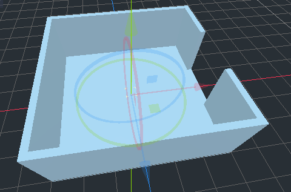
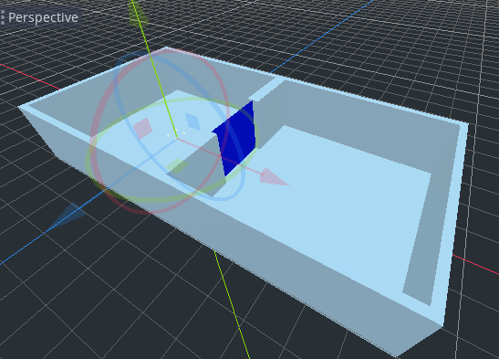
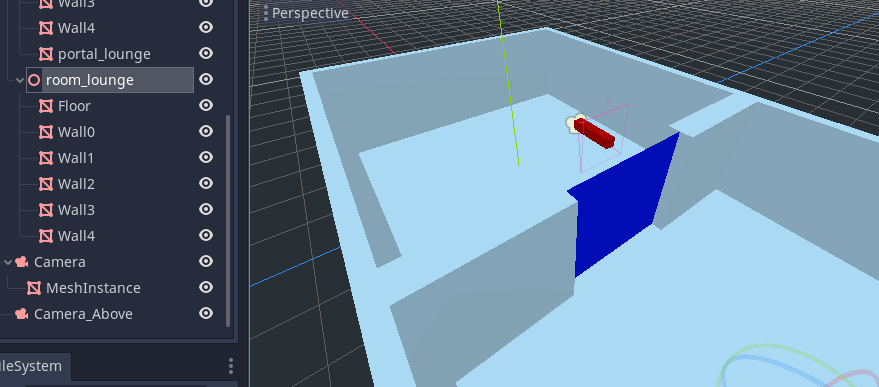
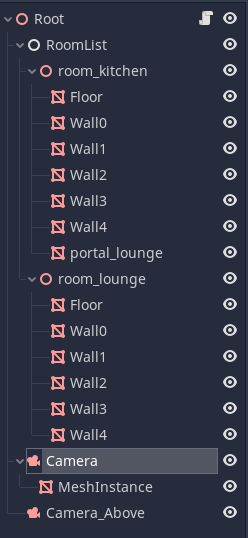
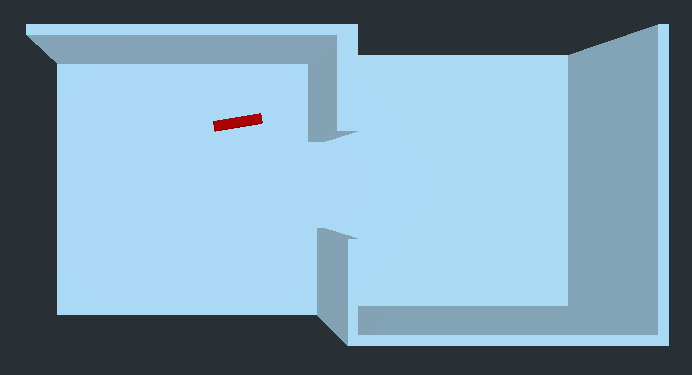

# LPortal Tutorial
_(A complete project is available in the LPortalTutorial.zip file.)_

1) Create a new Godot project, and add a spatial, this will be the root of your scene graph. Name it 'Root'.
2) Add an LRoomManager node as a child of the Root, and call it 'RoomList'. This will be where you place your rooms.
3) Create a spatial under the RoomList, and name it 'room_kitchen'.
4) As children of room_kitchen, create simple MeshInstance boxes for a floor and 4 walls, but make one of the walls out of 2 boxes, leaving a hole for a doorway.



5) Duplicate the entire room, and change the name to 'room_lounge'.
6) Change the location and rotation of the lounge so that the two rooms join, and the doorways match up.
7) Now we will add a portal to see between the rooms. There is no need to add it to both. Create a MeshInstance inside room_kitchen and name it 'portal_lounge'. This tells the system that you are making a portal that will see from the kitchen to the lounge.
8) The MeshInstance for portal_lounge should be a plane, and you should rotate and translate and scale it into position so it covers the doorway, facing into the lounge. You can give it a different color material to help see it.



9) At this point the room scene is complete, and we will create some of the usual objects needed in a game.
10) Create a camera as a child of the Root named 'Camera', and place it within the kitchen, pointing towards the lounge through the door.
11) In order to see where the camera node is, create a MeshInstance as a child of the node, and create a narrow box, facing along the direction the camera is pointing. Give this mesh instance a different color material so it is easy to see.



12) Create a SECOND camera as a child of the Root called 'Camera_Above', and place it above both rooms, looking down, and choose 'make current' in the IDE to make it the camera Godot uses (rather than the first camera).
13) Save the scene and run it, you should be able to see both rooms from above, with the box for the first camera.



Now it is time to start using LPortal.

14) Create a script for the Root node, call it 'Root.gd'.

It should contain the following:
```
extends Spatial

# Called when the node enters the scene tree for the first time.
func _ready():
	
	$RoomList.rooms_convert()
	
	$RoomList.rooms_set_camera($Camera)
	$RoomList.dob_register($Camera, 0)
	

# Called every frame. 'delta' is the elapsed time since the previous frame.
func _process(delta):
	$Camera.rotate_y(delta)
```
15) Now run the project. If all goes well you should now see the camera rotating from above, and different parts of the rooms get hidden and shown as they come into and out of view.



16) Now try moving the 'Camera' node to different locations in the room, and running again. You should be able to find camera locations where walls never come into view, because they are not visible through the portal.
17) Try adding other MeshInstances to the rooms - tables, chairs etc. See them culled as they move in and out of view.

If you make any mistakes, check that the portal and rooms have the exact correct names: 'room_kitchen', 'room_lounge', and 'portal_lounge'. You can examine the debug output produced during the conversion which should help diagnose any problems.

If the LRoomManager node is not available in the IDE, Godot has not been compiled with the LPortal module. See INSTRUCTIONS.md.
